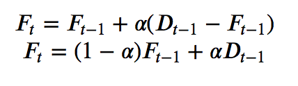
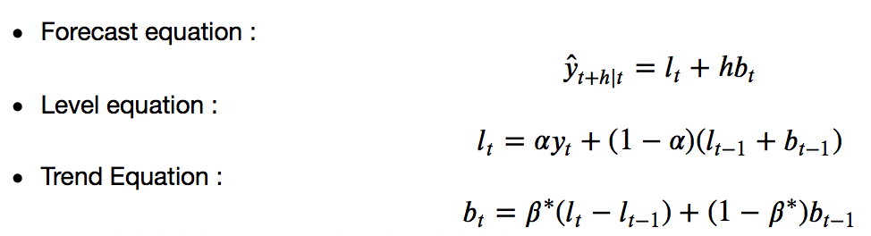
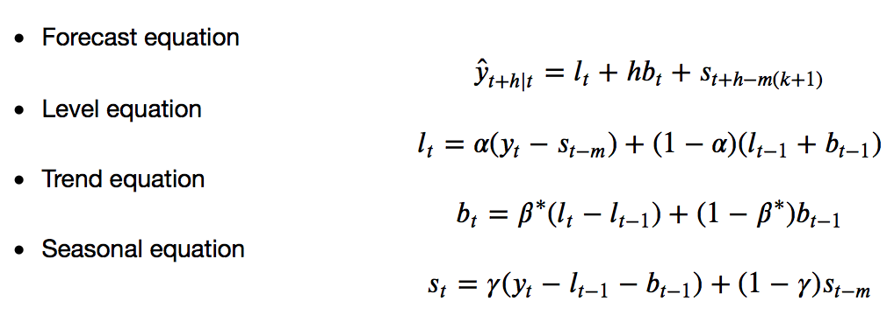

----------------------------------------------------------------------------------------------------
## 지수 평활법 (Exponential Smoothing) - Simple, Holt's, Holt-Winter's
### 1) Simple Exponential Smoothing
추세나 계절성 패턴이 없는 데이터를 예측할 때 쓰기 좋다.



> * $F_t$ : 현재 시점의 예측 값
* $F_{t-1}$ : 이전 시점의 예측 값
* $D_{t-1}$ : 이전 시점의 실제 값
* $\alpha$ : smoothing요소 , 0 < $\alpha$ < 1

[ 지수평활법의 특징 ] 
> 1. 단기간에 발생하는 불규칙 변동을 평활하는 방법
2. 지수평활법에서 가중치의 역할을 하는 것은 $\alpha$이며, 불규칙변동이 큰 시계열의 경우 지수평활계수는 작은 값을,<br>
불규칙변동이 작은 시계열의 경우, 큰 값의 지수평활계수를 적용함
3. 지수평활계수는 예측오차(실제 관측치와 예측치 사이의 잔차제곱합) 를 비교하여 예측오차가 가장 작은 값을 선택하는 것이 바람직함
4. 지수평활법은 불규칙변동의 영향을 제거하는 효과가 있음.

=> 합격자의 경우는 $\alpha =0.9$ 를 사용했으므로, 최근 가격을 많이 반영하게끔 만듬.


------------------------------------------------------------------------------------
### 2) Holt's Exponential Smoothing
홀트의 선형 추세 기법 <br>
https://otexts.com/fppkr/holt.html 

> * trend로 데이터를 예측하기 위해 Simple Exponential Smoothing에서 확장한 것이다.
* 예측을 위한 식 외에 level smoothing을 위한 식과 trend smoothing을 위한 식이 포함된다
* 생성된 예측은 선형적으로 나타나기 때문에 예측 범위가 멀어질 수록 over-forecast 되는 경향이 있다.
    * 감쇠홀트기법 : over-forecast를 보완할 방법
        * 미래 어느 시점에 추세를 평평하게 감쇠시키는 한 가지 매개변수를 도입하여 감쇠하는 추세(damped trend)를 포함하는 기법



> * $l_t$: t 시점에서의 level(수준)의 추정을 나타낸다.
* $b_t$: t 시점에서의 추세(경사)의 추정을 나타낸다.
* $\alpha$ level(수준)에 대한 smoothing parameter이고 다음과 같음 범위를 갖는다. 0 < 𝛼 < 1
* $\beta*$ : trend(추세)에 대한 smoothing parameter이고 다음과 같은 범위를 갖는다. 0 < 𝛽∗< 1
* level에 대한 식 $l_t$ 는 t 시간에 대한 관측치 𝑦𝑡 와 훈련 예측 𝑙𝑡−1+𝑏𝑡−1의 가중 평균을 나타낸다.
* trend에 대한 식 𝑏𝑡 는 (𝑙𝑡−𝑙𝑡−1)에 근거한 t시간에 대한 추정치와 이전 추정치인 𝑏𝑡−1의 가중 평균을 나타낸다.

------------------------------------------------------------------------------------
### 3) Holt-Winter's Exponential Smoothing
홀트-윈터스의 계절성 기법 <br>
https://otexts.com/fppkr/holt-winters.html

* Holt-Winter's 방법은 seasonality를 반영하기 위해 Holt's 방법에서 확장된 것이다.
* Holt-Winter's 방법은 예측식과 3개의 smoothing 식으로 구성되어 있다.
    * level에 대한 식  $𝑙_𝑡$
    * trend에 대한 식  𝑏−𝑡
    * seasonal에 대한 요소  $𝑠_𝑡$
    * smoothing parameter에 해당하는  𝛼, 𝛽∗,  𝛾

* seasonality의 빈도를 나타내기 위한  𝑚 (분기별 데이터에서는 m=4, 월별 데이터에서는 m=12)
    * seasonal이 변화하는 형태에 따라 두 가지 방법이 있다.
    * additive : seasonal의 변화가 일정하게 지속될 때
    * multiplicative : seasonal의 변화가 level에 비례적일 때





```python

```


```python

```


```python

```
